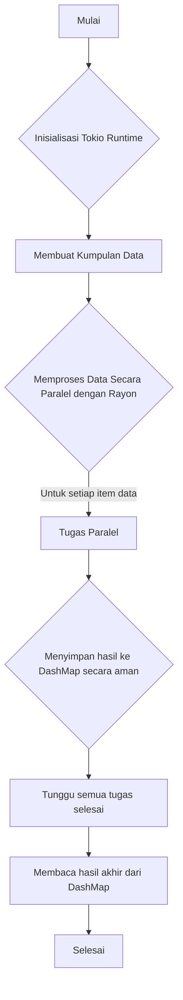

# Contoh Proyek Paralelisme di Rust dengan Tokio, Rayon, dan DashMap

Proyek ini adalah sebuah contoh bagaimana mengimplementasikan pemrosesan data secara paralel dan konkurensi di Rust. Ini mendemonstrasikan kombinasi dari beberapa *crate* populer untuk mencapai performa tinggi dalam tugas-tugas yang bersifat *CPU-bound* dan *I/O-bound*.

## Deskripsi

Tujuan utama dari proyek ini adalah untuk menunjukkan:
1.  **Runtime Asinkron (Tokio):** Menjalankan tugas-tugas secara independen tanpa memblokir thread utama.
2.  **Paralelisme Data (Rayon):** Memanfaatkan semua inti CPU yang tersedia untuk memproses koleksi data (seperti `Vec`) secara bersamaan.
3.  **Struktur Data Konkuren (DashMap):** Menyediakan sebuah *hash map* yang dapat diakses dan dimodifikasi dari banyak *thread* atau *task* secara aman dan efisien, tanpa memerlukan mekanisme *locking* manual yang rumit.

## Arsitektur

Secara umum, alur kerja aplikasi ini adalah sebagai berikut: Tokio sebagai *runtime* utama akan memulai proses. Di dalamnya, Rayon digunakan untuk memecah tugas pemrosesan data menjadi beberapa bagian kecil yang dijalankan secara paralel. Hasil dari setiap tugas paralel tersebut kemudian disimpan ke dalam DashMap untuk agregasi atau penyimpanan hasil akhir.



## Prasyarat

Pastikan Anda telah menginstal **Rust toolchain** (rustc dan cargo) di sistem Anda. Anda bisa menginstalnya melalui [rustup](https://rustup.rs/).

## Cara Penggunaan

1.  **Clone Repositori** (jika Anda belum melakukannya):
    ```bash
    git clone https://github.com/MamangRust/example-async-tokio-rayon-dashmap-parallel
    cd example-async-tokio-rayon-dashmap-parallel
    ```

2.  **Jalankan Aplikasi (Mode Debug)**
    Perintah ini akan mengompilasi dan menjalankan proyek. Cocok untuk pengembangan dan pengujian cepat.
    ```bash
    cargo run
    ```

3.  **Jalankan Aplikasi (Mode Rilis)**
    Untuk mendapatkan performa maksimal, kompilasi dan jalankan dalam mode rilis. Proses kompilasi akan lebih lama, tetapi hasil eksekusinya akan jauh lebih cepat.
    ```bash
    cargo run --release
    ```

## Teknologi yang Digunakan

-   [**Rust**](https://www.rust-lang.org/): Bahasa pemrograman utama.
-   [**Tokio**](https://tokio.rs/): Runtime untuk aplikasi asinkron.
-   [**Rayon**](https://github.com/rayon-rs/rayon): Crate untuk paralelisme data.
-   [**DashMap**](https://github.com/xacrimon/dashmap): Implementasi hash map yang sangat cepat dan aman untuk konkurensi.
